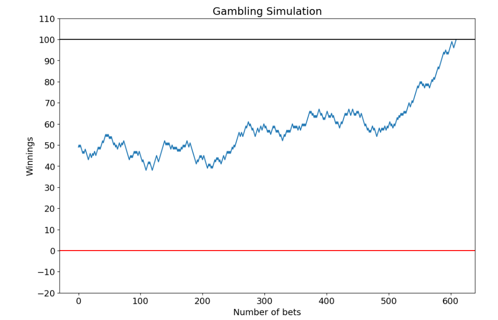
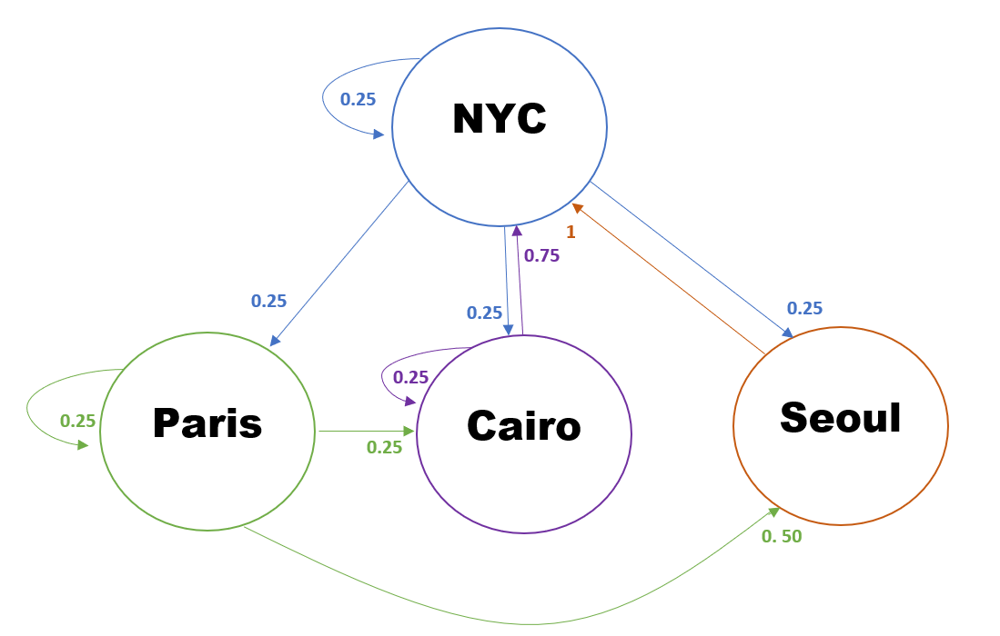

# Markov Chain Simulation

### Gambling Simulation

### Markov Transition Graph

### Youtube Tutorial Link
[An Introduction to Markov Chains with Python](https://www.youtube.com/watch?v=WT6jI8UgROI)